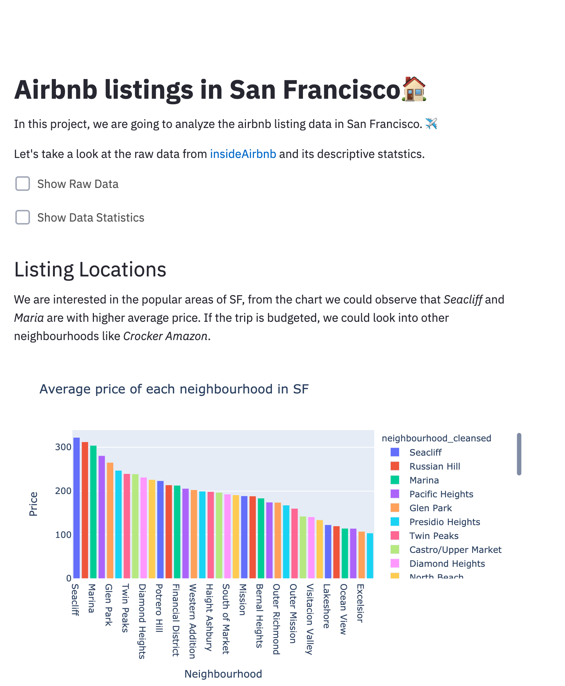
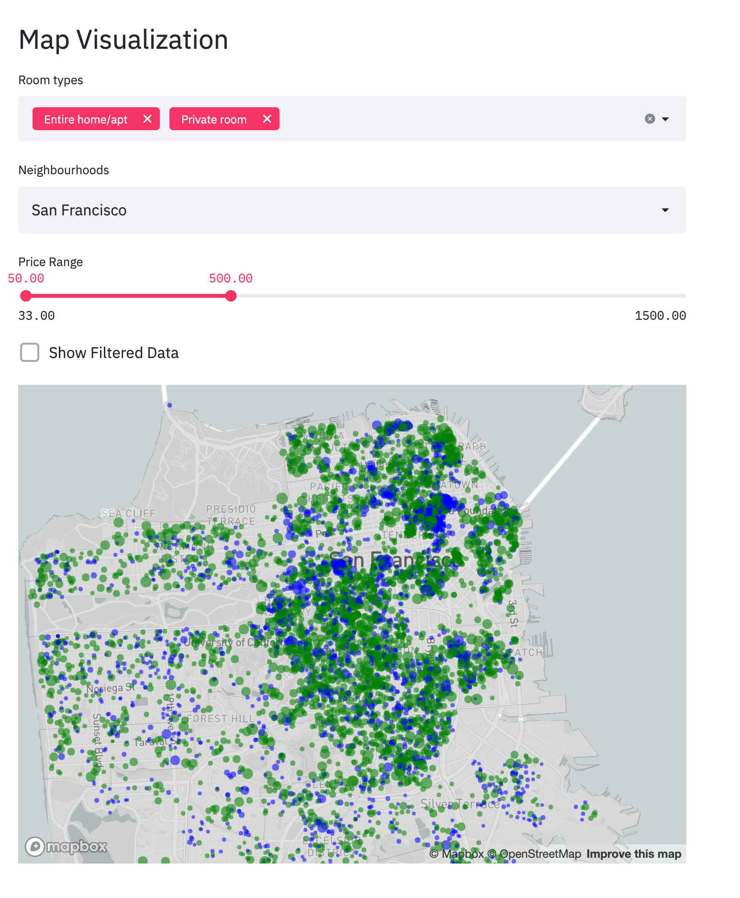
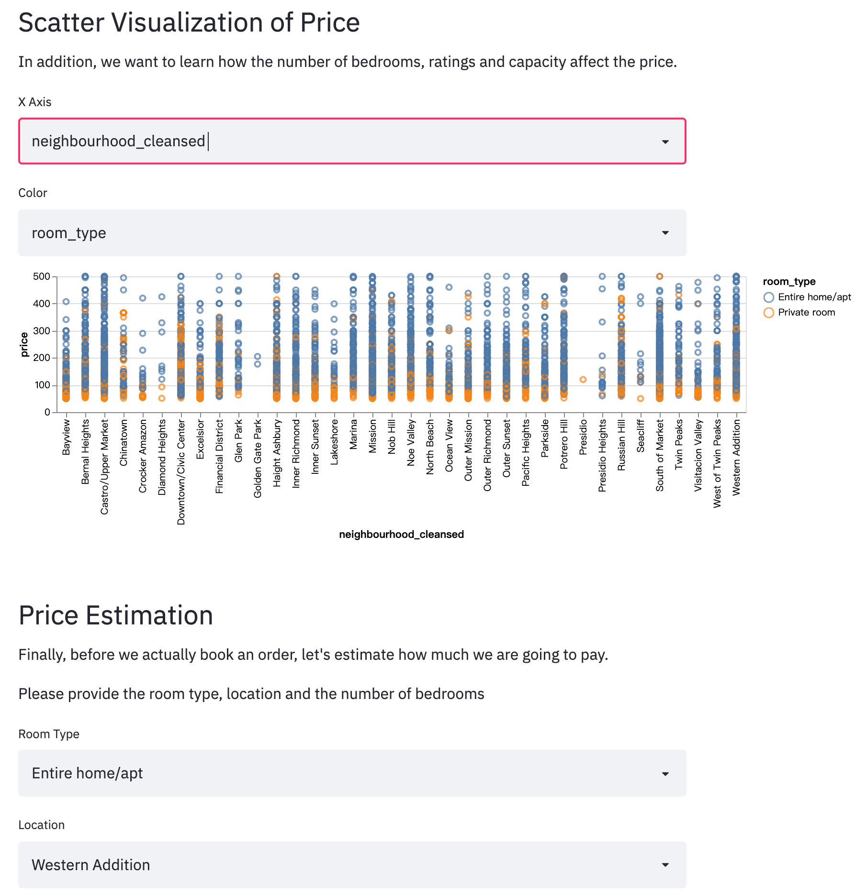
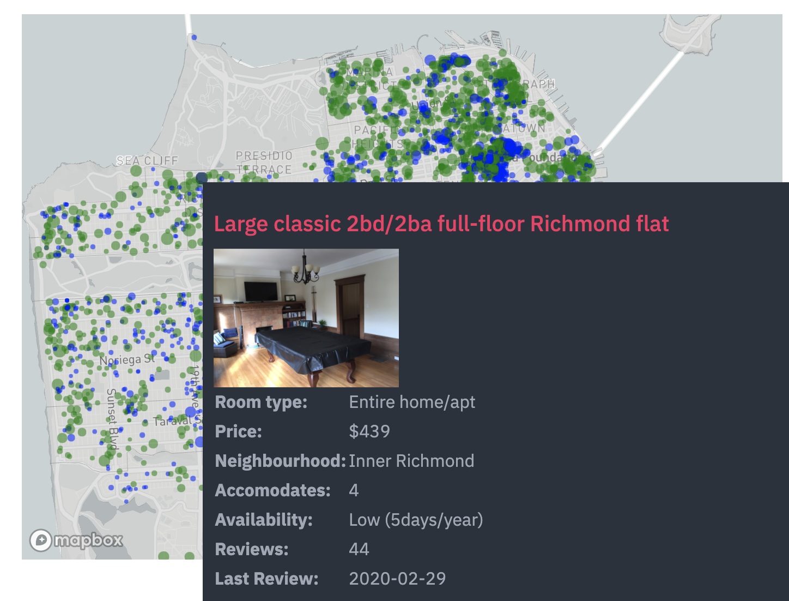

# Project Name: Airbnb Listings in San Francisco

This project is going to explore the Airbnb listings data in San Francisco. With the help of the streamlit, altair, deck.gl and plotly, we created an interactive visualization application for people to gain insightful information of the listings.

## Project Goals

Our project is an online Airbnb data visualization tool for San Fransisco area. The potential users are the hosts on Airbnb, those who are thinking about becoming a host on Airbnb or those who are planning to travel to SF.

* For those who are currently a host on Airbnb, this tool can help them better pricing their house, and help them understand how to make their customers willing to pay more for their house.

* For those who are thinking about becomming an Airbnb host, this tool can help them make an estimation on how much they could charge for their house, and decide if it is a good idea to become a host on Airbnb.

* For those who are planning to take a travel, this tool can help them navigate the pricing level of accomodation in SF, Airbnb housing availability and plan what specific location in SF should they stay according to their budget.

With the help of this tool, a user should be able to answer the following answers:

* What is the price distribution accross the different neighbourhoods in SF?

* What is the factors that affect the price and how are they refelct on a map?

* What is the availability level of Airbnb houses in SF?

* How is the relationship between price and other features of housing?

* What is the estimated price given some information of the potential listing?

<!-- TODO: **A clear description of the goals of your project.** Describe the question that you are enabling a user to answer. The question should be compelling and the solution should be focused on helping users achieve their goals.  -->

## Design

### Dataset

In this project, we are mainly focus on the San Francisco airbnb dataset from [insideAirbnb](http://insideairbnb.com). We used the listing data compiled on 07 September, 2020, which contains information like name, price, location, available days from each of the listing in SF.

Although the data is fairly clean, preprocessing is also needed to eliminate the nan values and outliers, encode color to different room types, etc..

### Visual Encodings

We had a brief discussion on the factors which could affect the pricing of a house. We believe that there are several factors which would affect the price the most: room type, location, number of bedrooms, review ratings.

We agree that the *map* is the best way to visualize the location of the houses, the color represents different type of rooms and the size of the circle indicates the price of that specific house.

We also need graphs to display the relationship between price and other data. For the graph, we both agree that *scatter plot* is the best way to show the correlations. 

For the availability distribution and price distribution across the neighbourhoods, bar charts are straightforward. As for the percentage of the availbility, pie charts are suitable. We once considered displaying the elevation of specific area representing its pricing level, but it was messy after experiment so we gave up.

### Interaction Techniques

#### Filtered Map
By interacting with the filter widget, user can view the map with differnt conditions for further investigations.

#### Tooltip
{:height="50%" width="50%"}

When users are interested in specific houses, they could view the detail via tooltip by hovering on the circle on the map.
Information like name, no. of reviews, availability, and the pic of the house... wil appear for reference.

#### Price Estimation
We have a price estimation tool which use k-nn algorithm to estimate the price of the room, which would be very helpful for the users.

<!-- TODO: **A rationale for your design decisions.** How did you choose your particular visual encodings and interaction techniques? What alternatives did you consider and how did you arrive at your ultimate choices? -->

## Development

We first schedule a meeting to discuss what data we want to investigate, and we both find that Airbnb data is very interesting. We did feasibility analysis by looking into the dimensions of the data and evaluating the data quality.

After exploring the structure of the data, we then posed research questions we would like to dive deep into. Then it took us about an hour to briefly discuss the design our application, including the visualization encoding of each categories of data and different sections of our webpage. 

For this development of the webpage,  Zixuan was in charge of the data filter structure and the map visualization, and Andong was in charge of the scatter plot visualization and the price estimation. The total time we spent on this project is about 30 people-hours. 

The implementation part definitely took the most time. Since we are new to data visualization, the process of reading documentation of different awesome library is time-comsuming. Also we spent great amount of time on the experiments on different types of visual encodings.

<!-- TODO: **An overview of your development process.** Describe how the work was split among the team members. Include a commentary on the development process, including answers to the following questions: Roughly how much time did you spend developing your application (in people-hours)? What aspects took the most time?
 -->